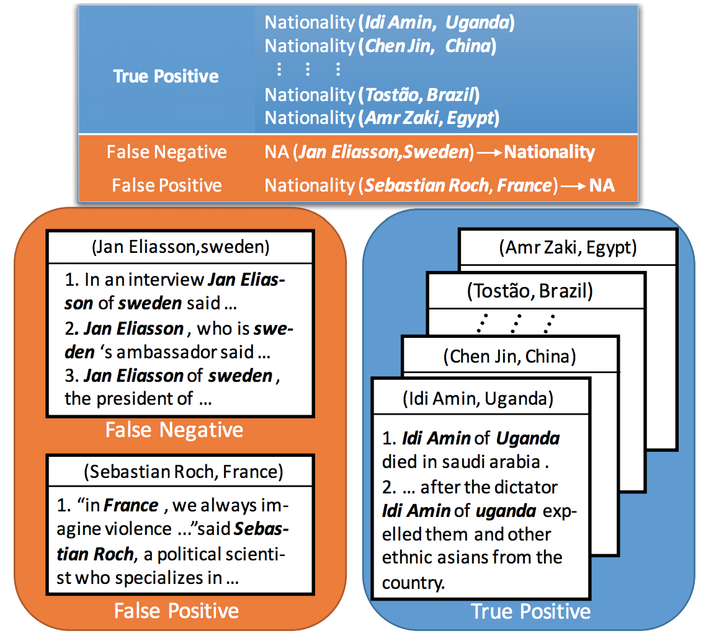

# soft-label-RE
This project provides the implementation of distantly supervised relation extraction with (bag-level) soft-label adjustment.

Details of soft-label adjustment can be found [here](http://aclweb.org/anthology/D17-1189). The implementation is based on Tensorflow 1.0.0 and Python 2.7.

# Model Overview
<p align="center"></p>

## Distantly Supervised Relation Extraction

Distant supervision automatically generates training examples by aligning entity mentions in plain text with those in KB and labeling entity pairs with their relations in KB. If there's no relation link between certain entity pair in KB, it will be labeled as negative instance (NA).

## Multi-instance Learning
The automatic labeling by KB inevitably accompanies with wrong labels because the relations of entity pairs might be missing from KBs or mislabeled.
Multi-instances learning (MIL) is proposed to combat the noise. The method divides the training set into multiple bags of entity pairs (shown in the figure above) and labels the bags with the relations of entity pairs in the KB (**bag-level DS label**).
Each bag consists of sentences mentioning both head and tail entities.
Much effort has been made in reducing the influence of noisy sentences within the bag,
including methods based on at-least-one assumption and attention mechanisms over instances. 

##  Bag-level Mislabeling
As shown in the figure above, due to the absence of (Jan Eliasson, Sweden)(Jan Eliasson is a Swedish diplomat.) from the Nationality relation in the KB,the entity pair is mislabeled as NA.

Actually, no matter how we design the attention weight calculation of the sentences in that bag, the bag would be a noisy instance during training.
So we try to solve the problem from a different point of view. Since the bag-level DS label can be wrong, we design a soft-label adjustment on the bag-level DS label to correct the ill-labeled cases.

# Installation
Although our model can be trained on a CPU, using GPU can greatly accelerate the speed. So we strongly recommended using GPUs to train the model.
## Tensorflow
Our code is based on Tensorflow 1.0.0. You can find the installation instructions [here](https://www.tensorflow.org/versions/r1.1/install/).
## Dependencies
```requirements.txt``` summarize the dependencies of our code. You can install these dependencies by:
```
pip install -r requirements.txt
```

# Data
The benchmark dataset we use is FB+NYT (New York Times corpus as text resources; Freebase as distant supervision) which is also a widely benchmark dataset for many previous work. 

The dataset we use can be downloaded via [Google Drive](https://drive.google.com/file/d/1l6bpgeTjiZ5t-3XFD-gKc9R1R0h5L0jX/view?usp=sharing) or [Baidu Yunpan](https://pan.baidu.com/s/1dG3PAjn).
Please unzip the ```data.zip``` in the ```soft-label-RE``` directory.

# Usage
## Pre-train
To avoid negative effects of dominant NA instances in the begining of training, soft-label method is adopted after about 3000 steps of parameter updates. During pre-training, the ```use_pre_train_model``` and  ```use_soft_label``` should be set as False. 
```
tf.app.flags.DEFINE_boolean("use_pre_train_model", False,'use pre-trained model or label') 
tf.app.flags.DEFINE_boolean("use_soft_label", False,'use soft label or not')
tf.app.flags.DEFINE_string("load_model_name", 'pretrain/model.ckpt-3300','the path of pre-trained model without soft-label')
```
We provide two pre-trained models for ONE and ATT, respectively. The pre-trained models can be downloaded via [Google Drive](https://drive.google.com/file/d/1Wo9vw2hd8NY6XRe1djkXdLySqcv8B0cG/view?usp=sharing) or [Baidu Yunpan](https://pan.baidu.com/s/1sm6OVnR).

Please unzip the ```pretrain.zip``` in the ```soft-label-RE``` directory.

Then, you can load the ONE model by setting:
```
tf.app.flags.DEFINE_boolean("use_pre_train_model", True,'use pre-trained model or label') 
tf.app.flags.DEFINE_string("load_model_name", 'pretrain/one/model.ckpt-3300','the path of pre-trained model without soft-label')
```
or load the ATT model by setting:
```
tf.app.flags.DEFINE_boolean("use_pre_train_model", True,'use pre-trained model or label') 
tf.app.flags.DEFINE_string("load_model_name", 'pretrain/att/model.ckpt-3600','the path of pre-trained model without soft-label')
```
## Train
You can choose ATT (selective attention) or ONE (at-least-one) model as the bag representation by setting the ```one_or_att``` to ```att``` or ```one```.
```
tf.app.flags.DEFINE_string("one_or_att",'one','at-least-one or selective attention model')
```

Then run the ```main.py```.
```
python main.py
```
The results can be found in ```res/TIME_STAMP/log.txt```.

# Reference
If you find the code and data resources helpful, please cite the following paper:
```
@inproceedings{liu2017soft,
  title={A Soft-label Method for Noise-tolerant Distantly Supervised Relation Extraction},
  author={Liu, Tianyu and Wang, Kexiang and Chang, Baobao and Sui, Zhifang},
  booktitle={Proceedings of the 2017 Conference on Empirical Methods in Natural Language Processing},
  pages={1790--1795},
  year={2017}
}
```
